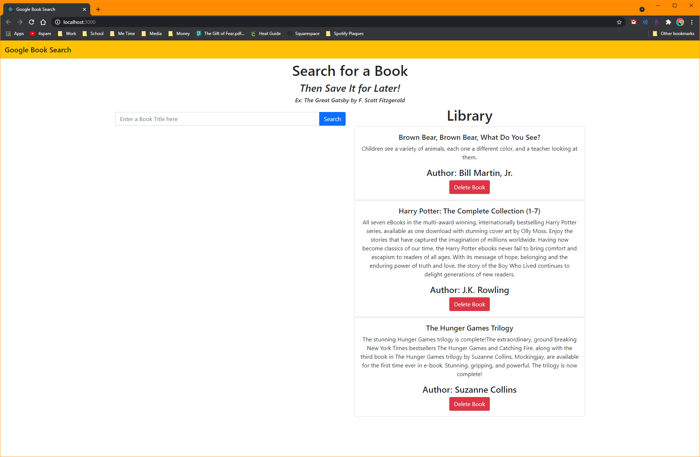
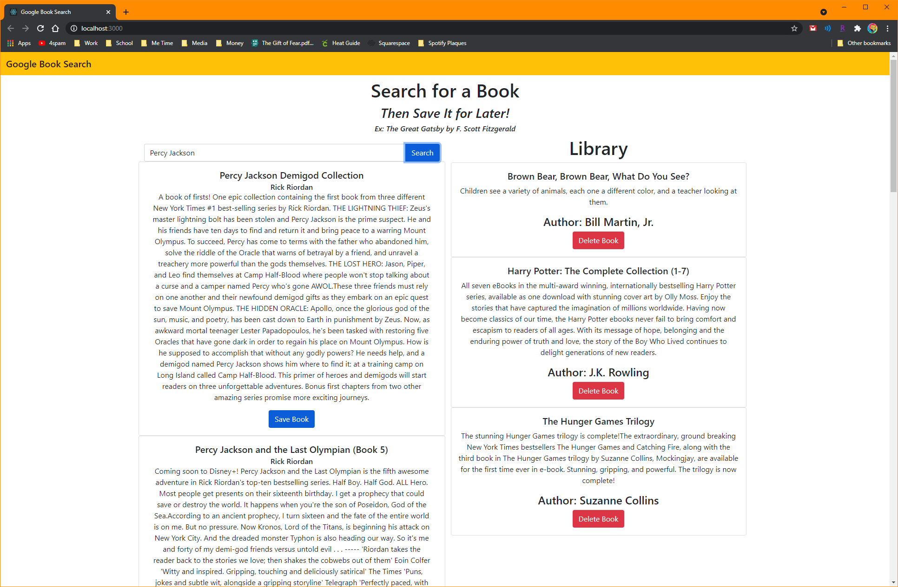
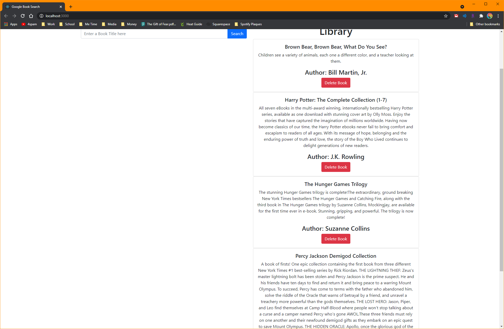
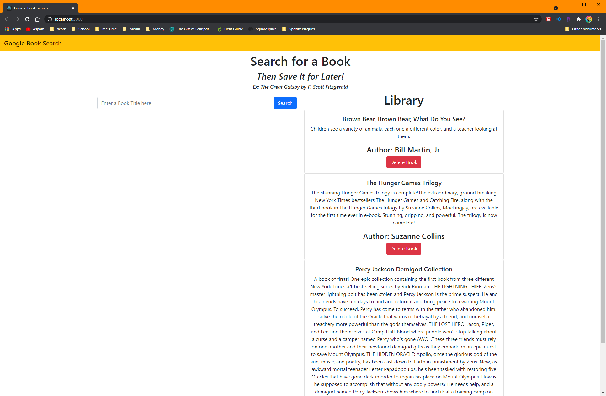

# Google Book Search
## *Subtitle/Mini Description*
**Technologies used: Express, MongoDB, Router, Bootstrap**

------------

Link to my deployed application : <a href="https://still-gorge-00379.herokuapp.com/">Here</a>

------------

I'm tired. Most of my time has been dictated by the needs of my final project. This assignment would not have been completed were it not for my amazing tutor. She was incredibly patient with me, explained everything in great detail, step by step, and helped me cross the finish line. 

Google Books Search is an application for searching for books on Google, the only thing making it different from a standard Google search is the ability to save the books to your own personal library for later, using the 'Save Book' button present below each book's summary. Add a book to your Library and automatically refresh the page, showing your new book at the bottom, and clearing the search area for your next discovery. Once you've finished a book, or no longer want it in your Library, hit the 'Delete Book' button to remove it, and automatically refresh the page. 

That's all folks!

------------

Link to my deployed application : <a href="https://still-gorge-00379.herokuapp.com/">Here</a>

